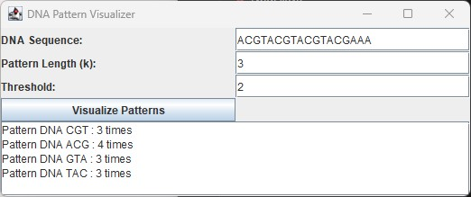

# DNA Pattern Visualizer

## Introduction
The DNA Pattern Visualizer is a Java application that analyzes DNA sequences, identifies recurring patterns, and visualizes these patterns. This project provides an educational tool for understanding DNA sequences and their patterns using a simple graphical user interface.

## Main Features
### LinkedList and Node Classes
- **Node**: Represents a single nucleotide in the DNA sequence.
- **LinkedList**: Manages the sequence of nucleotides, providing methods to add nucleotides and retrieve the head of the list.

### DNAPatternCounter Class
- **countPatterns**: Analyzes the DNA sequence stored in a linked list to identify recurring patterns of length `k`.
- **getPatternMap**: Returns a map of identified patterns and their counts.

### DNAPatternVisualizer Class
- **Graphical Interface**: Provides an interface for inputting DNA sequences, pattern length (`k`), and a threshold value to filter patterns.
- **Visualization**: Displays a graphical representation of the DNA helix and highlights patterns that occur more frequently than the specified threshold.

### General Idea of the Code
- Save the DNA sequence as a linked list.
- Iterate through the linked list to identify patterns of length `k`.
- Count occurrences of each pattern and store them in a map.
- Visualize patterns that meet the threshold criteria.

## Screenshot

## How to Use
1. **DNA Sequence Input**: Enter the DNA sequence you want to analyze.
2. **Pattern Length (k)**: Specify the length of the patterns you are interested in.
3. **Threshold**: Set the threshold value to filter patterns that occur frequently.
4. **Visualize**: Click the "Visualize Patterns" button to see the patterns and their occurrences in the DNA sequence.

## Example Usage
1. **Input DNA Sequence**: `ACGTACGTACGTACG`
2. **Pattern Length (k)**: `3`
3. **Threshold**: `2`
4. **Output**: The application will display patterns that appear at least 2 times, such as `ACG`, `CGT`, etc.

## Technologies Used
- **Java**: The primary programming language used for building the application.
- **Swing**: For creating the graphical user interface.
- **HashMap**: For storing and counting DNA patterns.
- **LinkedList**: For managing the sequence of nucleotides efficiently.

## Variables and Data Structures
### Variables
- **dnaSequence**: Stores the input DNA sequence provided by the user.
- **k**: The length of the pattern to search for in the DNA sequence.
- **threshold**: The minimum number of occurrences for a pattern to be displayed.
- **dnaInput, kInput, thresholdInput**: GUI components for user input.
- **resultArea**: Displays the results of the pattern analysis.

### Data Structures
- **HashMap**: Used to store patterns and their counts. The key is the pattern (String) and the value is the count (Integer). HashMap provides efficient O(1) average time complexity for insertions and lookups, making it suitable for counting and storing patterns.
- **LinkedList**: Used to store the sequence of nucleotides. LinkedList allows for efficient traversal and manipulation of the sequence. Each nucleotide is represented as a node, and nodes are linked together to form the sequence.

### Diagram Description
The diagram illustrates the flow and structure of the DNA Pattern Counter application: 
- **Node and LinkedList**: Represents the DNA sequence as interconnected nodes, each holding a nucleotide. 
- **Pattern Analysis**: Shows how the sequence is traversed to identify recurring patterns. 
- **HashMap**: Depicts the storage of patterns and their counts for efficient retrieval and filtering based on the threshold.

### Step-by-Step Code Execution

1. **Save the DNA Sequence as a Linked List**:
    - The DNA sequence provided by the user is stored as a linked list. This involves creating `Node` instances for each character (nucleotide) in the sequence and linking them together.
    -  _Store each character of the sequence as a node._

2. **Iterate Through the Linked List**:
    - The program makes a loop that traverses through the linked list until it reaches the end.
    -  _Allows examination of each nucleotide to form patterns._

3. **Initialize Current Pattern List**:
    - The current pattern list is initialized with the first `k` elements (where `k` is the pattern length specified by the user) from the linked list.
    -  _Initializes the pattern to start the counting process._

4. **Save Initial Pattern in Pattern Map**:
    - The first pattern of length `k` is saved in a `HashMap` called `patternMap`, with the pattern as the key and the count as the value.
    -  _Stores initial pattern count._

5. **Update Pattern List**:
    - The first element is deleted from the current pattern list, and the next element from the linked list is added.
    -  _Updates the current pattern list with the next element._

6. **Move to Next Node**:
    - The `patternStartNode` is updated to the next node in the linked list to keep track of the elements used from the initial linked list.
    - `patternStartNode = patternStartNode.next;`
    -  _Tracks used nodes to ensure correct pattern formation._

7. **Check Pattern in Pattern Map**:
    - The program checks if the current pattern is already in the `patternMap`.
    - If found, the count of the pattern is incremented.
    - If not found, the pattern is added to the `patternMap` with a count of 1.
    -  _Increments count if pattern exists; adds if not._

8. **Move to Next Element**:
    - The `current` node is updated to the next node in the linked list.
    - `current = current.next;`
    -  _Moves to the next nucleotide in the sequence._

9. **Repeat Until End of Linked List**:
    - Steps 5, 6, 7, and 8 are repeated until the end of the linked list is reached.
    -  _Ensures all possible patterns of length `k` are examined._

10. **Filter Patterns by Threshold**:
    - The program loops through the `patternMap` and prints only those patterns that appear more than the specified threshold.
    -  _Prints patterns that meet the threshold criteria._

### Rationale for Using LinkedList and HashMap

- **LinkedList**: 
    - **Dynamic Size**: A linked list is dynamic in nature, allowing efficient insertion and deletion of elements. This is crucial for dynamically building the DNA sequence from user input.
    - **Traversal**: Linked lists provide an efficient way to traverse through the sequence, which is necessary for pattern formation and counting.
    - **Memory Usage**: Linked lists use memory efficiently by allocating memory only when needed for each node.

- **HashMap**: 
    - **Efficiency**: HashMap provides average O(1) time complexity for insertions and lookups, making it ideal for counting and storing patterns.
    - **Easy Access