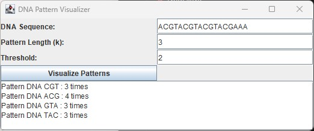

# DNA Pattern Visualizer

## Introduction
The DNA Pattern Counter is a Java application designed to analyze DNA sequences, identify recurring patterns, and count their occurrences. This tool can be highly beneficial for educational purposes and for those interested in bioinformatics.

## Main Features

- **Node**: Represents a single nucleotide in the DNA sequence.
- **LinkedList**: Manages the sequence of nucleotides, providing methods to add nucleotides and retrieve the head of the list.
- **DNAPatternCounter Class**: This class contains methods to count patterns within the linked list and print those that meet a specified threshold.
- **Efficient Data Structures**: Uses HashMap for storing and counting DNA patterns due to its average O(1) time complexity for insertions and lookups.


### DNAPatternCounter Class
- **countPatterns**: Analyzes the DNA sequence stored in a linked list to identify recurring patterns of length `k`.
- **getPatternMap**: Returns a map of identified patterns and their counts.

### DNAPatternVisualizer Class
- **Graphical Interface**: Provides an interface for inputting DNA sequences, pattern length (`k`), and a threshold value to filter patterns.
- **Visualization**: Displays a graphical representation of the DNA helix and highlights patterns that occur more frequently than the specified threshold.

### General Idea of the Code
- Save the DNA sequence as a linked list.
- Iterate through the linked list to identify patterns of length `k`.
- Count occurrences of each pattern and store them in a map.
- Visualize patterns that meet the threshold criteria.

## Screenshot


## How to Use
1. **DNA Sequence Input**: Enter the DNA sequence you want to analyze.
2. **Pattern Length (k)**: Specify the length of the patterns you are interested in.
3. **Threshold**: Set the threshold value to filter patterns that occur frequently.
4. **Visualize**: Click the "Visualize Patterns" button to see the patterns and their occurrences in the DNA sequence.

## Example Usage
1. **Input DNA Sequence**: `ACGTACGTACGTACG`
2. **Pattern Length (k)**: `3`
3. **Threshold**: `2`
4. **Output**: The application will display patterns that appear at least 2 times, such as `ACG`, `CGT`, etc.

## Technologies Used
- **Java**: The primary programming language used for building the application.
- **Swing**: For creating the graphical user interface.
- **HashMap**: For storing and counting DNA patterns.
- **LinkedList**: For managing the sequence of nucleotides efficiently.

## Variables and Data Structures
### Variables
- **dnaSequence**: Stores the input DNA sequence provided by the user.
- **k**: The length of the pattern to search for in the DNA sequence.
- **threshold**: The minimum number of occurrences for a pattern to be displayed.
- **dnaInput, kInput, thresholdInput**: GUI components for user input.
- **resultArea**: Displays the results of the pattern analysis.

### Data Structures
- **HashMap**: Used to store patterns and their counts. The key is the pattern (String) and the value is the count (Integer). HashMap provides efficient O(1) average time complexity for insertions and lookups, making it suitable for counting and storing patterns.
- **LinkedList**: Used to store the sequence of nucleotides. LinkedList allows for efficient traversal and manipulation of the sequence. Each nucleotide is represented as a node, and nodes are linked together to form the sequence.

### Diagram Description
The diagram illustrates the flow and structure of the DNA Pattern Counter application: 
- **Node and LinkedList**: Represents the DNA sequence as interconnected nodes, each holding a nucleotide. 
- **Pattern Analysis**: Shows how the sequence is traversed to identify recurring patterns. 
- **HashMap**: Depicts the storage of patterns and their counts for efficient retrieval and filtering based on the threshold.


## How It Works

### Step-by-Step Code Execution

1. **Initialize the Data Structures**
    ```java
    private static LinkedList linkedList = new LinkedList();
    private static HashMap<String, Integer> patternMap = new HashMap<>();
    private static int k; // Pattern length
    private static int threshold; // Threshold count
    ```
    - **Description**: Initialize the `LinkedList` to store the DNA sequence and `HashMap` to store patterns and their counts. `k` is the pattern length, and `threshold` is the minimum count for patterns to be displayed.

2. **Define Main Method and Parameters**
    ```java
    public static void main(String[] args) {
        String dnaSequence = "ACGTACGTACGTACGAA";
        k = 3;
        threshold = 2;
    ```
    - **Description**: Define the `main` method and set the example DNA sequence, pattern length (`k`), and threshold for pattern filtering.

3. **Add DNA Sequence to LinkedList**
    ```java
        for (char c : dnaSequence.toCharArray()) {
            linkedList.add(c);
        }
    ```
    - **Description**: Convert the DNA sequence into characters and add each character to the `LinkedList`.

4. **Count Patterns in the LinkedList**
    ```java
        countPatterns(linkedList.getHead());
    ```
    - **Description**: Call the `countPatterns` method to analyze the `LinkedList` and count patterns of length `k`.

5. **Print Patterns Meeting the Threshold**
    ```java
        printPatterns();
    }
    ```
    - **Description**: Call the `printPatterns` method to display patterns that appear more than the specified threshold.

6. **Define countPatterns Method**
    ```java
    private static void countPatterns(Node head) {
        Node current = head;
        StringBuilder currentPattern = new StringBuilder();
        Node patternStartNode = current;
    ```
    - **Description**: Initialize `current` to the head of the `LinkedList`, `currentPattern` to build patterns, and `patternStartNode` to track the start of patterns.

7. **Iterate Through LinkedList to Form Patterns**
    ```java
        while (current != null) {
            currentPattern.append(current.data);
    ```
    - **Description**: Traverse the `LinkedList`, appending each character to `currentPattern`.

8. **Ensure Pattern Length Does Not Exceed k**
    ```java
            if (currentPattern.length() > k) {
                currentPattern.deleteCharAt(0);
                patternStartNode = patternStartNode.next;
            }
    ```
    - **Description**: If `currentPattern` exceeds length `k`, remove the first character and update `patternStartNode`.

9. **Process Pattern of Length k**
    ```java
            if (currentPattern.length() == k) {
                String pattern = currentPattern.toString();
                patternMap.put(pattern, patternMap.getOrDefault(pattern, 0) + 1);
            }
    ```
    - **Description**: When `currentPattern` reaches length `k`, convert it to a string and update its count in the `patternMap`.

10. **Move to Next Node**
    ```java
            current = current.next;
        }
    }
    ```
    - **Description**: Move to the next node in the `LinkedList` and repeat the process until the end of the list.

11. **Define printPatterns Method**
    ```java
    private static void printPatterns() {
        for (String pattern : patternMap.keySet()) {
            if (patternMap.get(pattern) > threshold) {
                System.out.println("Pattern DNA " + pattern + " : " + patternMap.get(pattern) + " times");
            }
        }
    }
    ```
    - **Description**: Iterate through the `patternMap` and print patterns that appear more than the specified threshold.

### Rationale for Using LinkedList and HashMap

- **LinkedList**: 
    - **Dynamic Size**: Allows efficient insertion and deletion of elements, which is crucial for dynamically building the DNA sequence.
    - **Traversal**: Provides an efficient way to traverse through the sequence for pattern formation and counting.
    - **Memory Usage**: Uses memory efficiently by allocating memory only when needed for each node.

- **HashMap**: 
    - **Efficiency**: Offers average O(1) time complexity for insertions and lookups, ideal for counting and storing patterns.
    - **Easy Access**: Enables easy retrieval of pattern counts, essential for filtering and printing patterns based on the threshold.
    - **Flexibility**: Handles different types of keys and values, making it suitable for storing patterns and their corresponding counts.


### Rationale for Using LinkedList and HashMap

- **LinkedList**: 
    - **Dynamic Size**: A linked list is dynamic in nature, allowing efficient insertion and deletion of elements. This is crucial for dynamically building the DNA sequence from user input.
    - **Traversal**: Linked lists provide an efficient way to traverse through the sequence, which is necessary for pattern formation and counting.
    - **Memory Usage**: Linked lists use memory efficiently by allocating memory only when needed for each node.

- **HashMap**: 
    - **Efficiency**: HashMap provides average O(1) time complexity for insertions and lookups, making it ideal for counting and storing patterns.
    - **Easy Access