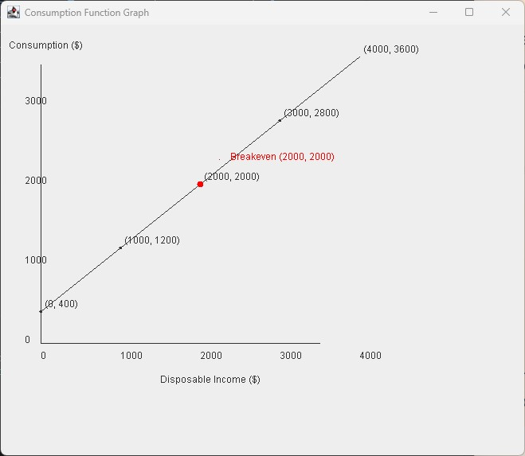

# Economic Break-Even Analysis

## Project Overview
In this project, we analyze a simple economy where disposable income (Y) affects consumption (C). Given the consumption function \( C = 400 + 0.8Y \), we determine the level of income where consumers break even (i.e., where consumption equals income).

### Main Objectives:
- Identify the break-even income/consumption point.
- Graph the consumption function accurately.
- Follow the provided instructions to draw and label the required objects.

## Part 1: Break-Even Income/Consumption Point
In the given simple economy (assuming no taxes), the consumption function is defined as:

\[ C = 400 + 0.8Y \]

To find the level of income where consumers break even:

\[ Y = C \]

Setting \( C = 400 + 0.8Y \) equal to Y, we get:

\[ Y = 400 + 0.8Y \]

Solving for Y:

\[ 0.2Y = 400 \]

\[ Y = 2000 \]

Thus, the level of income at which the consumer breaks even is **$2000**.

## Part 2: Graphing the Consumption Function
### 1. Identifying the Break-Even Point
- Use the point drawing tool to plot the break-even income/consumption point at **($2000, $2000)**.

### 2. Graphing the Consumption Function
- Use the line drawing tool to carefully graph the consumption function.
- The line should start at the intercept (where \( Y = 0 \) and \( C = 400 \)) and extend through the break-even point at **($2000, $2000)**.
- Properly label your line as "Consumption Function: \( C = 400 + 0.8Y \)".

## Part 3: Instructions for Drawing
Follow these instructions to complete the graph:
- Use the point drawing tool to mark the break-even point **($2000, $2000)**.
- Use the line drawing tool to graph the line starting from the intercept (0, 400) through the break-even point.
- Label the line "Consumption Function: \( C = 400 + 0.8Y \)".

## Screenshot

